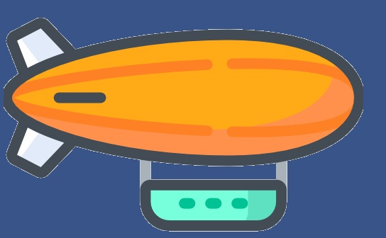

-                  
🎈

       13 +                  

       14 +                      

HTML Changes:
  - Replaced the emoji balloon (🎈) with an  element pointing to resources/airship.jpg

  CSS Changes:
  - Updated .airship-icon styles to accommodate the image
  - Set image size to 60x60px with object-fit: contain
  - Added rounded borders for a polished look
  - Maintained hover scaling effect

  JavaScript Changes:
  - Modified updateAirshipProgression() to work with the image instead of changing emoji
  - Added color filters that change the airship's hue based on Bitcoin tier progression:
    - Solo Explorer (₿0.1-1.0): Default color
    - Freedom Cruiser (₿1.0-5.0): 60° hue shift
    - World Explorer (₿5.0-10.0+): 120° hue shift + brightness boost

  Now your airship image will visually evolve as players accumulate more Bitcoin, changing colors to reflect
  their progression through the freedom tiers. The language switching between English and Chinese is also fully
   functional.

   ● Update(styles.css)
  ⎿  Updated styles.css with 5 additions and 2 removals
       42    }
       43
       44    .airship-icon img {
       45 -      width: 15px;
       46 -      height: 15px;
       45 +      max-width: 15px;
       46 +      max-height: 15px;
       47 +      width: 15px !important;
       48 +      height: 15px !important;
       49        object-fit: contain;
       50        border-radius: 50%;
       51        transition: transform 0.3s ease;
       52 +      display: block;
       53    }
       54